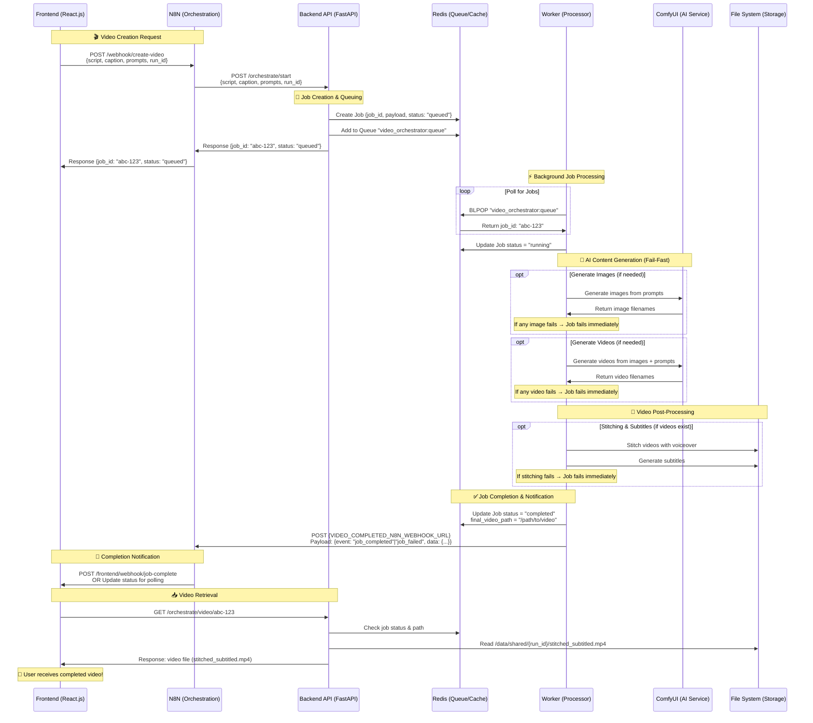

# Video Processing System - Sequence Diagram



## 📋 API Endpoints Reference

| Endpoint | Method | Description |
|----------|--------|-------------|
| `/orchestrate/start` | POST | Create new video processing job |
| `/orchestrate/status/{job_id}` | GET | Check job status and metadata |
| `/orchestrate/video/{job_id}` | GET | Download completed video file |
| `{VIDEO_COMPLETED_N8N_WEBHOOK_URL}` | POST | N8N receives job completion/failure notifications |

## 💾 Data Flow

### Redis Storage:
- `video_orchestrator:queue` - Job queue (LPUSH/RPOP)
- `video_orchestrator:job:{job_id}` - Job metadata (JSON)

### File System:
- `/data/shared/{run_id}/` - Job working directory
- `stitched_subtitled.mp4` - Final video file
- `voiceover.mp3` - Audio file (if generated)
- `manifest.json` - Job configuration

## 🔄 Processing Pipeline

```
1. Queued    → 2. Running    → 3. AI Generation    → 4. Post-Processing    → 5. Completed/Failed
   ↓             ↓                    ↓                        ↓                   ↓
Job Created  Worker Picks Up     Images/Videos/Voiceover  Stitching/Subtitles  Webhook Sent
   ↓             ↓                    ↓                        ↓                   ↓
Redis Queue  Status Update       ComfyUI Processing       FFmpeg Processing   N8N Notified
   ↓             ↓                    ↓                        ↓                   ↓
   |             |                    |                        |                   |
   |             |                    |                        |                   |
   |             |                    |                        |                   |
   ↓             ↓                    ↓                        ↓                   ↓
   ✗ ←────────── ✗ ←──────────────── ✗ ←──────────────────── ✗ ←────────────── ✗
   Fail Fast: Any step fails → Entire job fails immediately (no partial results)
```

## 🌐 Network Architecture

```
┌─────────────┐    ┌─────────────┐    ┌─────────────┐
│   Frontend  │    │    N8N      │    │   Backend   │
│  (React.js) │◄──►│ (Orchestr.) │◄──►│   (FastAPI) │
└─────────────┘    └─────────────┘    └─────────────┘
       │                   │                   │
       │                   │                   │
       └───────────────────┼───────────────────┘
                           │
                    ┌──────▼──────┐
                    │    Redis    │
                    │   (Queue)   │
                    └─────────────┘
                           │
                    ┌──────▼──────┐
                    │   Worker    │
                    │ (Processor) │
                    └─────────────┘
                           │
                    ┌──────▼──────┐
                    │  ComfyUI    │
                    │    (AI)     │
                    └─────────────┘
                           │
                    ┌──────▼──────┐
                    │ File System │
                    │  (Storage)  │
                    └─────────────┘

## 🔧 Configuration

### Environment Variables:
```bash
VIDEO_COMPLETED_N8N_WEBHOOK_URL=https://your-n8n-instance.com/webhook/job-complete
REDIS_URL=redis://your-redis-instance:6379/0
DATA_SHARED_BASE=/data/shared
COMFYUI_URL=http://your-comfyui-instance:8188
```

### Webhook Payload Structure:
```json
{
  "event": "job_completed", // or "job_failed"
  "timestamp": 1643123456.789,
  "data": {
    "job_id": "22e247be-5d73-480d-a1bc-19f6b5754f43",
    "status": "completed", // or "failed"
    "run_id": "user-run-123",
    "output_dir": "/data/shared/user-run-123",
    "final_video_path": "/data/shared/user-run-123/stitched_subtitled.mp4", // only for completed
    "error": "Error message details", // only for failed
    "video_files": ["vid_001.mp4", "vid_002.mp4"],
    "image_files": ["img_001.png", "img_002.png"],
    "voiceover_path": "/data/shared/user-run-123/voiceover.mp3"
  }
}
