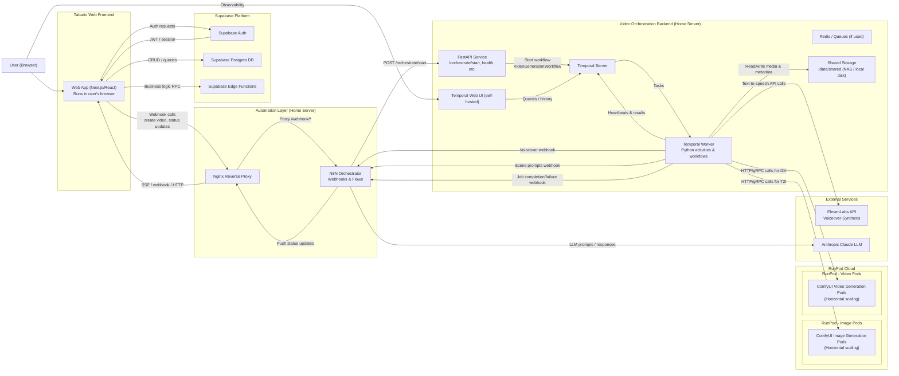

# Tabario Platform - Container Diagram

```mermaid
flowchart LR
    %% Actors
    U["User (Browser)"]

    %% Frontend + BFF
    subgraph FE["Tabario Web Frontend"]
        F["Web App (Next.js/React)<br/>Runs in user's browser"]
    end

    %% Supabase backend
    subgraph SB["Supabase Platform"]
        SBA["Supabase Auth"]
        SBD["Supabase Postgres DB"]
        SBF["Supabase Edge Functions"]
    end

    %% Nginx + N8N
    subgraph N8N_STACK["Automation Layer (Home Server)"]
        NP["Nginx Reverse Proxy"]
        N8N["N8N Orchestrator<br/>Webhooks & Flows"]
    end

    %% Video orchestration backend
    subgraph BE["Video Orchestration Backend (Home Server)"]
        API["FastAPI Service<br/>/orchestrate/start, health, etc."]
        TS["Temporal Server"]
        TW["Temporal Worker<br/>Python activities & workflows"]
        TUI["Temporal Web UI (self-hosted)"]
        RQ["Redis / Queues (if used)"]
        FS["Shared Storage<br/>/data/shared (NAS / local disk)"]
    end

    %% RunPod ComfyUI cluster
    subgraph RP["RunPod Cloud"]
        subgraph RPIMG["RunPod - Image Pods"]
            CIMG["ComfyUI Image Generation Pods<br/>(Horizontal scaling)"]
        end
        subgraph RPV["RunPod - Video Pods"]
            CVID["ComfyUI Video Generation Pods<br/>(Horizontal scaling)"]
        end
    end

    %% External SaaS
    subgraph EXT["External Services"]
        EL["ElevenLabs API<br/>Voiceover Synthesis"]
        CLD["Anthropic Claude LLM"]
    end

    %% Relationships
    U --> F

    %% Frontend <-> Supabase
    F -->|Auth requests| SBA
    SBA -->|JWT / session| F
    F -->|CRUD / queries| SBD
    F -->|Business logic RPC| SBF

    %% Frontend <-> N8N
    F -->|Webhook calls<br/>create video, status updates| NP
    NP -->|Proxy /webhook/*| N8N
    N8N -->|Push status updates| NP
    NP -->|SSE / webhook / HTTP| F

    %% N8N <-> Orchestration API
    N8N -->|POST /orchestrate/start| API
    API -->|Start workflow<br/>VideoGenerationWorkflow| TS

    %% Temporal
    TS -->|Tasks| TW
    TW -->|Heartbeats & results| TS

    %% Worker <-> storage
    TW -->|Read/write media & metadata| FS

    %% Worker <-> RunPod
    TW -->|HTTP/gRPC calls for T2I| CIMG
    TW -->|HTTP/gRPC calls for I2V| CVID

    %% Worker <-> N8N (webhooks)
    TW -->|Voiceover webhook| N8N
    TW -->|Scene prompts webhook| N8N
    TW -->|Job completion/failure webhook| N8N

    %% Worker <-> ElevenLabs (when used directly)
    TW -->|Text-to-speech API calls| EL

    %% N8N <-> Anthropic Claude LLM
    N8N -->|LLM prompts / responses| CLD

    %% Temporal UI
    U -->|Observability| TUI
    TUI -->|Queries / history| TS
```
