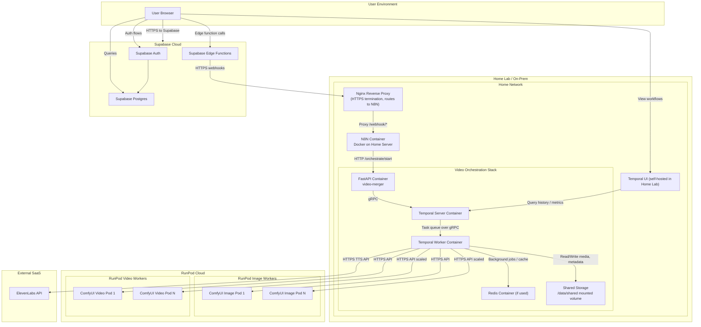

# Tabario Platform - Deployment Diagram

```mermaid
flowchart TB
    %% Top level execution environments
    subgraph USER_ENV["User Environment"]
        BR["User Browser"]
    end

    subgraph HOME["Home Lab / On-Prem"]
        subgraph HOME_NET["Home Network"]
            NGX["Nginx Reverse Proxy<br/>(HTTPS termination, routes to N8N)"]
            N8N["N8N Container<br/>Docker on Home Server"]
            TEMP_UI["Temporal UI (self-hosted in Home Lab)"]

            subgraph VIDEO_STACK["Video Orchestration Stack"]
                API["FastAPI Container<br/>video-merger"]
                TEMPSRV["Temporal Server Container"]
                TEMPWRK["Temporal Worker Container"]
                REDIS["Redis Container (if used)"]
                NAS["Shared Storage<br/>/data/shared mounted volume"]
            end
        end
    end

    subgraph SUPABASE_ENV["Supabase Cloud"]
        SBA["Supabase Auth"]
        SBD["Supabase Postgres"]
        SBF["Supabase Edge Functions"]
    end

    subgraph RUNPOD_ENV["RunPod Cloud"]
        subgraph RUNPOD_IMG["RunPod Image Workers"]
            RP_IMG1["ComfyUI Image Pod 1"]
            RP_IMGN["ComfyUI Image Pod N"]
        end
        subgraph RUNPOD_VID["RunPod Video Workers"]
            RP_VID1["ComfyUI Video Pod 1"]
            RP_VIDN["ComfyUI Video Pod N"]
        end
    end

    subgraph EXT_SAAS["External SaaS"]
        EL["ElevenLabs API"]
    end

    %% Edges / deployment relations
    BR -->|HTTPS to Supabase| SUPABASE_ENV

    %% Supabase Edge Functions to Nginx/N8N
    SBF -->|HTTPS webhooks| NGX
    NGX -->|Proxy /webhook/*| N8N

    %% N8N to home stack
    N8N -->|HTTP /orchestrate/start| API
    API -->|gRPC| TEMPSRV
    TEMPSRV -->|Task queue over gRPC| TEMPWRK

    %% Worker to storage / queue
    TEMPWRK -->|Read/Write media, metadata| NAS
    TEMPWRK -->|Background jobs / cache| REDIS

    %% Worker to RunPod
    TEMPWRK -->|HTTPS API| RP_IMG1
    TEMPWRK -->|HTTPS API scaled| RP_IMGN
    TEMPWRK -->|HTTPS API| RP_VID1
    TEMPWRK -->|HTTPS API scaled| RP_VIDN

    %% Worker to ElevenLabs
    TEMPWRK -->|HTTPS TTS API| EL

    %% Supabase internal
    BR -->|Auth flows| SBA
    BR -->|Queries| SBD
    BR -->|Edge function calls| SBF
    SBA --> SBD

    %% Observability (Temporal UI is self-hosted in Home Lab)
    BR -->|View workflows| TEMP_UI
    TEMP_UI -->|Query history / metrics| TEMPSRV
```
