# Video Upscaling System - Sequence Diagram

```mermaid
sequenceDiagram
    actor U as User
    participant F as Frontend (Tabario)
    participant S as Supabase Edge Function
    participant N as N8N
    participant B as Backend API (FastAPI /upscale)
    participant T as Temporal Server
    participant TW as Temporal Worker
    participant R as RunPod (AI Upscaling)
    participant FS as File System (Storage)

    Note over U,N: 🎬 Video Upscaling Request
    U->>F: Clicks "Upscale Video" button<br/>for completed video
    F->>S: POST /edge-function/upscale<br/>{run_id, user_id, target_resolution}
    S->>N: Forward upscale request
    
    Note over N,B: 🚀 Workflow Initiation
    N->>B: POST /upscale/start<br/>{run_id, user_id, target_resolution, workflow_id}
    B->>T: Start Workflow 'VideoUpscalingWorkflow'<br/>with workflow_id + run_id
    B-->>N: 202 Accepted {workflow_id, run_id}
    N-->>S: {workflow_id, run_id, status: "started"}
    S-->>F: {workflow_id, run_id, status: "started"}

    Note over T,TW: ⚡ Parent Workflow Execution
    T->>TW: Add 'VideoUpscalingWorkflow' Task to Queue
    TW->>T: Poll for Task
    TW-->>TW: Execute Parent Workflow Logic

    Note over TW,FS: 📂 List Video Clips to Upscale
    TW->>T: Schedule Activity 'list_run_videos_for_upscale'
    T->>TW: Execute 'list_run_videos_for_upscale'
    TW->>FS: Read /data/shared/{run_id}/<br/>Find all 000_*.mp4, 001_*.mp4, etc.
    FS-->>TW: Return list of video clip paths
    TW-->>TW: Found N video clips to upscale

    loop For each video clip (parallel execution)
        Note over TW: 👶 Start Child Workflow per Clip
        TW->>T: Start Child Workflow 'VideoUpscalingChildWorkflow'<br/>{run_id, video_id, video_path, target_resolution}
        T->>TW: Add Child Workflow Task to Queue
        TW->>T: Poll for Child Task
        TW-->>TW: Execute Child Workflow Logic

        Note over TW,R: 🤖 AI Upscaling via RunPod
        TW->>T: Schedule Activity 'start_video_upscaling'
        T->>TW: Execute 'start_video_upscaling'
        TW->>R: POST RunPod API<br/>{video_base64, target_resolution}
        R-->>TW: {job_id}

        Note over TW,R: ⏳ Poll for Upscaling Completion
        TW->>T: Schedule Activity 'poll_upscale_status'
        T->>TW: Execute 'poll_upscale_status'
        loop Poll every 15 seconds (max 15 minutes)
            TW->>R: GET RunPod Status API<br/>{job_id}
            R-->>TW: {status: "IN_PROGRESS"}
        end
        R-->>TW: {status: "COMPLETED", output: upscaled_video_base64}

        Note over TW,FS: 💾 Save Upscaled Video
        TW->>T: Schedule Activity 'save_upscaled_video'
        T->>TW: Execute 'save_upscaled_video'
        TW->>FS: Write /data/shared/{run_id}/{video_id}_upscaled.mp4
        FS-->>TW: File saved successfully

        TW->>T: Report Child Workflow Completion
    end

    Note over TW: ⏸️ Wait for All Child Workflows
    TW-->>TW: All video clips upscaled successfully

    Note over TW: 🎞️ Start Stitching Workflow
    TW->>T: Start Child Workflow 'VideoUpscalingStitchWorkflow'<br/>{run_id, user_id, workflow_id}
    T->>TW: Add Stitch Workflow Task to Queue
    TW->>T: Poll for Stitch Task
    TW-->>TW: Execute Stitch Workflow Logic

    Note over TW,FS: 📋 List Upscaled Videos
    TW->>T: Schedule Activity 'list_upscaled_videos'
    T->>TW: Execute 'list_upscaled_videos'
    TW->>FS: Read /data/shared/{run_id}/<br/>Find all *_upscaled.mp4 files
    FS-->>TW: Return list of upscaled video paths

    Note over TW,FS: 🎬 Stitch Videos with Voiceover
    TW->>T: Schedule Activity 'stitch_videos'
    T->>TW: Execute 'stitch_videos'
    TW->>FS: Read upscaled clips + voiceover.mp3
    TW-->>TW: Use ffmpeg to concatenate videos<br/>and add voiceover audio
    TW->>FS: Write /data/shared/{run_id}/stitched_output.mp4
    FS-->>TW: Stitched video saved

    Note over TW,FS: 📝 Burn Subtitles into Video
    TW->>T: Schedule Activity 'burn_subtitles_into_video'
    T->>TW: Execute 'burn_subtitles_into_video'
    TW->>FS: Read stitched_output.mp4 + generated.srt
    TW-->>TW: Use ffmpeg to burn subtitles<br/>into video
    TW->>FS: Write /data/shared/{run_id}/final_video.mp4
    FS-->>TW: Final upscaled video saved<br/>Path: /data/shared/{run_id}/final_video.mp4

    TW->>T: Report Stitch Workflow Completion<br/>Return: final_video_path

    alt Workflow Success
        Note over TW,N: ✅ Send Completion Webhook
        TW->>T: Schedule 'send_upscale_completion_webhook' activity
        T->>TW: Execute activity
        TW->>N: POST {VIDEO_COMPLETED_N8N_WEBHOOK_URL}<br/>{run_id, status: "completed", final_video_path, video_files, voiceover_path, output_dir}

    else Workflow Failure
        Note over TW,N: ❌ Send Failure Webhook
        TW-->>TW: Workflow logic catches exception
        TW->>T: Schedule 'send_upscale_completion_webhook' activity
        T->>TW: Execute activity
        TW->>N: POST {VIDEO_COMPLETED_N8N_WEBHOOK_URL}<br/>{run_id, status: "failed", failure_reason}
    end

    Note over N,F: 📢 Notification to Frontend
    N->>S: Notify of upscaling completion
    S->>F: Update UI with upscaled video status

    Note over U: 👀 User can monitor progress in Temporal UI
    U->>T: View workflow status in Temporal UI
```



## 📋 API Endpoints Reference

| Endpoint | Method | Description |
|----------|--------|-------------|
| `/upscale/start` | POST | Start video upscaling workflow (returns `workflow_id` + `run_id`) |
| `{VIDEO_COMPLETED_N8N_WEBHOOK_URL}` | POST | N8N receives upscaling completion/failure notifications |

## 💾 Data Flow

### Temporal Server:
- Stores all workflow state, history, and outcomes.
- Manages task queues for upscaling workflows and activities.
- Task Queue: `video-upscaling-task-queue`

### File System:
- `/data/shared/{run_id}/` - Run working directory (from original video generation)
- **Input Files:**
  - `000_*.mp4`, `001_*.mp4`, etc. - Original video clips to upscale
  - `voiceover.mp3` - Original voiceover audio
  - `generated.srt` - Subtitle file
- **Output Files:**
  - `000_*_upscaled.mp4`, `001_*_upscaled.mp4`, etc. - Upscaled video clips
  - `stitched_output.mp4` - Concatenated upscaled clips with voiceover
  - `final_video.mp4` - Final upscaled video with burned subtitles

### RunPod:
- AI-powered video upscaling service
- Receives video as base64, returns upscaled video as base64
- Polling-based status checking (15-second intervals, 15-minute timeout)

## 🔄 Processing Pipeline

Temporal orchestrates the upscaling pipeline using a parent/child workflow model for parallel processing and fault tolerance.

1. **Parent Workflow (`VideoUpscalingWorkflow`)**:
   - Initiated by the `/upscale/start` endpoint.
   - Lists all video clips in the run directory using `list_run_videos_for_upscale` activity.
   - Starts a child workflow for each video clip to enable parallel upscaling.

2. **Child Workflows (`VideoUpscalingChildWorkflow`)**:
   - One child workflow per video clip (e.g., 7 clips = 7 parallel child workflows).
   - Each child workflow executes:
     - `start_video_upscaling` - Submits video to RunPod API
     - `poll_upscale_status` - Polls RunPod until upscaling completes
     - `save_upscaled_video` - Saves upscaled video to file system
   - **Parallel execution**: All clips are upscaled simultaneously for faster processing.
   - **Fault tolerance**: If one clip fails, only that child workflow retries.

3. **Stitch Workflow (`VideoUpscalingStitchWorkflow`)**:
   - Starts after all child workflows complete successfully.
   - Executes:
     - `list_upscaled_videos` - Lists all upscaled video clips
     - `stitch_videos` - Concatenates upscaled clips with voiceover using ffmpeg
     - `burn_subtitles_into_video` - Burns subtitles into final video using ffmpeg
   - Returns the final video path.

4. **Notification (Parent Workflow)**:
   - The parent workflow calls `send_upscale_completion_webhook` activity.
   - Sends comprehensive payload to N8N including:
     - `final_video_path` - Path to final upscaled video
     - `video_files` - List of all upscaled clip paths
     - `voiceover_path` - Path to voiceover file
     - `output_dir` - Run directory path

## 🌐 Network Architecture


## 🔧 Configuration

### Environment Variables:
```bash
# Points to the Temporal Server gRPC endpoint
TEMPORAL_SERVER_URL=temporal:7233

# N8N webhook for upscaling completion/failure notifications
VIDEO_COMPLETED_N8N_WEBHOOK_URL=https://your-n8n-instance.com/webhook/job-complete

# Shared volume for data exchange between services
DATA_SHARED_BASE=/data/shared

# RunPod API configuration
RUNPOD_API_KEY=your-runpod-api-key
RUNPOD_VIDEO_INSTANCE_ID=your-runpod-video-upscaling-instance-id

# Upscaling configuration
UPSCALE_BATCH_SIZE=21  # Number of clips to process in parallel
```

### Webhook Payload Structure:

**Success:**
```json
{
  "run_id": "qs6jxdshmo7",
  "status": "completed",
  "output_dir": "/data/shared/qs6jxdshmo7",
  "final_video_path": "/data/shared/qs6jxdshmo7/final_video.mp4",
  "video_files": [
    "/data/shared/qs6jxdshmo7/000_227346eafda54094a3337bb722731e61_upscaled.mp4",
    "/data/shared/qs6jxdshmo7/001_04f193a249734030a4747ac2473290a6_upscaled.mp4",
    "/data/shared/qs6jxdshmo7/002_c097ad4e379a47f1af633272b0502836_upscaled.mp4"
  ],
  "voiceover_path": "/data/shared/qs6jxdshmo7/voiceover.mp3",
  "workflow_id": "upscale-user-123-qs6jxdshmo7",
  "user_id": "user-123"
}
```

**Failure:**
```json
{
  "run_id": "qs6jxdshmo7",
  "status": "failed",
  "output_dir": "/data/shared/qs6jxdshmo7",
  "failure_reason": "RunPod upscaling timeout after 15 minutes",
  "workflow_id": "upscale-user-123-qs6jxdshmo7",
  "user_id": "user-123"
}
```

## 🧭 Legend

- **U** – User in the Tabario frontend initiating video upscaling.
- **F** – Frontend web app (Tabario UI running in the browser).
- **S** – Supabase Edge Function (serverless function layer).
- **N** – N8N automation orchestrator, handling webhooks and notifications.
- **B** – Backend API (`/upscale/start` FastAPI service) that starts Temporal workflows.
- **T** – Temporal Server (workflow state, task queues, history).
- **TW** – Temporal Worker running Python activities and workflows.
- **R** – RunPod AI upscaling service (cloud GPU instances).
- **FS** – Shared file system (`/data/shared/{run_id}`) for video clips, voiceover, and final output.

## 🎯 Key Features

### Parallel Processing
- All video clips are upscaled simultaneously using child workflows
- Significantly faster than sequential processing
- Example: 7 clips upscaled in parallel vs. one-by-one

### Fault Tolerance
- If a single clip fails to upscale, only that child workflow retries
- Other clips continue processing unaffected
- Parent workflow waits for all children before proceeding

### Resumability
- Temporal's workflow state management allows resuming from failure points
- No need to re-upscale already completed clips
- Workflow history preserved for debugging

### Progress Tracking
- Real-time monitoring via Temporal UI
- Each child workflow shows individual clip progress
- Parent workflow shows overall upscaling status

## 🔗 Related Architecture Diagrams

For related system documentation, see:

- **Video Processing Sequence Diagram** – Original video generation flow:
  - `docs/VIDEO_PROCESSING_SEQUENCE_DIAGRAM.md`

- **Container Diagram** – Overview of major services and how they interact:
  - `docs/TABARIO_CONTAINER_DIAGRAM.md`

- **Deployment Diagram** – Where each component runs (home lab, RunPod, Supabase, etc.):
  - `docs/TABARIO_DEPLOYMENT_DIAGRAM.md`
