# Video Processing System - Sequence Diagram

```mermaid
sequenceDiagram
    actor U as User
    participant F as Frontend
    participant N as N8N
    participant B as Backend API (FastAPI /orchestrate)
    participant T as Temporal Server
    participant TW as Temporal Worker
    participant C as ComfyUI (AI Service)
    participant FS as File System (Storage)

    Note over U,N: 🎬 Video Creation Request
    U->>F: Fills out video creation form
    F->>N: POST /webhook/create-video<br/>{script, caption, run_id, language, image_style, enable_image_gen, elevenlabs_voice_id}

    Note over N,B:  Workflow Initiation
    N->>B: POST /orchestrate/start<br/>{script, caption, run_id, language, image_style, enable_image_gen, elevenlabs_voice_id}
    B->>T: Start Workflow 'VideoGenerationWorkflow'<br/>with workflow_id + run_id
    B-->>N: 202 Accepted {workflow_id, run_id}
    N-->>F: {workflow_id, run_id, status: "started"}

    Note over T,TW: ⚡ Parent Workflow Execution
    T->>TW: Add 'VideoGenerationWorkflow' Task to Queue
    TW->>T: Poll for Task
    TW-->>TW: Execute Parent Workflow Logic

    Note over TW,N: 🔊 Voiceover Generation
    TW->>T: Schedule Activity 'generate_voiceover'
    T->>TW: Execute 'generate_voiceover'
    TW->>N: POST Voiceover N8N Webhook<br/>{script, runId, elevenlabs_voice_id, language}
    N-->>FS: Generate voiceover.mp3 in /data/shared/{run_id}
    TW-->>FS: Write voiceover_metadata.json<br/>{audio_duration}

    Note over TW,N: 🧩 Scene Prompt Generation
    TW->>T: Schedule Activity 'generate_scene_prompts'
    T->>TW: Execute 'generate_scene_prompts'
    TW->>N: POST Scene Generator Webhook<br/>{script, audio_duration, image_style}
    N-->>TW: {prompts: [{image_prompt, video_prompt}, ...]}

    loop For each generated scene prompt
        Note over TW: 👶 Start Child Workflow per Scene
        TW->>T: Start Child Workflow 'ProcessSceneWorkflow'<br/>{run_id, image_prompt, video_prompt}
        T->>TW: Add Child Workflow Task to Queue
        TW->>T: Poll for Child Task
        TW-->>TW: Execute Child Workflow Logic

        Note over TW,C: 🤖 Scene-specific AI Generation
        TW->>T: Schedule Activity 'generate_image'
        T->>TW: Execute 'generate_image'
        TW->>C: Call ComfyUI for image (T2I)
        C-->>TW: Image results
        TW->>T: Schedule Activity 'generate_video_from_image'
        T->>TW: Execute 'generate_video_from_image'
        TW->>C: Call ComfyUI for video (I2V)
        C-->>TW: Video results

        TW->>T: Report Child Workflow Completion
    end

    alt Workflow Success
        Note over TW,N: ✅ Send Completion Webhook
        TW->>T: Schedule 'send_completion_webhook' activity
        T->>TW: Execute activity
        TW->>N: POST {VIDEO_COMPLETED_N8N_WEBHOOK_URL}<br/>{workflow_id, run_id, status: "completed", ...}

    else Workflow Failure
        Note over TW,N: ❌ Send Failure Webhook
        TW-->>TW: Workflow logic catches exception
        TW->>T: Schedule 'send_completion_webhook' activity
        T->>TW: Execute activity
        TW->>N: POST {VIDEO_COMPLETED_N8N_WEBHOOK_URL}<br/>{workflow_id, run_id, status: "failed", ...}
    end

    Note over N,F: 📢 Notification to Frontend
    N->>F: Notify frontend of job status update

    Note over U: 👀 User can monitor progress in Temporal UI
    U->>T: View workflow status in Temporal UI
```



## 📋 API Endpoints Reference

| Endpoint | Method | Description |
|----------|--------|-------------|
| `/orchestrate/start` | POST | Create new video processing job (returns `workflow_id` + `run_id`) |
| `/orchestrate/status/{run_id}` | GET | Check workflow status (via Temporal UI). Note: Direct video download endpoint is removed as files are accessed via shared volume. |
| `{VIDEO_COMPLETED_N8N_WEBHOOK_URL}` | POST | N8N receives job completion/failure notifications (includes `workflow_id` for correlation) |

## 💾 Data Flow

### Temporal Server:
- Stores all workflow state, history, and outcomes.
- Manages task queues for workflows and activities.

### File System:
- `/data/shared/{run_id}/` - Run working directory
- `manifest.json` - The initial payload for the workflow run.
- `voiceover.mp3` - Voiceover audio file (generated by N8N voiceover flow).
- `voiceover_metadata.json` - Metadata written by `generate_voiceover` (e.g., `audio_duration`).
- `scene_prompts.json` - Prompts written by `generate_scene_prompts` for traceability.
- `final_video.mp4` - Final stitched and subtitled video file.

## 🔄 Processing Pipeline

Temporal orchestrates the entire pipeline using a parent/child workflow model for enhanced robustness and resumability.

1.  **Parent Workflow (`VideoGenerationWorkflow`)**: 
    - Initiated by the `/orchestrate/start` endpoint.
    - Executes initial setup activities like `setup_run_directory`.
    - Calls `generate_voiceover` activity, which invokes the N8N voiceover webhook and records `audio_duration` in `voiceover_metadata.json`.
    - Calls `generate_scene_prompts` activity, which invokes the N8N Scene Generator webhook using `{script, audio_duration, image_style}` and returns a list of `{image_prompt, video_prompt}` pairs.

2.  **Child Workflows (`ProcessSceneWorkflow`)**:
    - The parent workflow loops through each generated prompt and starts a separate `ProcessSceneWorkflow` for each one.
    - Each child workflow is responsible for a single scene and executes its own activities: `generate_image`, `upload_image_for_video_generation`, and `generate_video_from_image`.
    - **This is the key to resumability**: If a single scene fails, only its corresponding child workflow is retried.

3.  **Finalization (Parent Workflow)**:
    - The parent workflow waits for all child workflows to complete.
    - It then collects the results and runs the final activities: `stitch_videos` and `burn_subtitles_into_video`.

4.  **Notification**: The parent workflow calls the `send_completion_webhook` activity to notify N8N of the final status.

## 🌐 Network Architecture

```mermaid
graph TD
    subgraph User Interaction
        U[User] --> F[Frontend]
        U --> TUI[Temporal UI]
    end

    subgraph Workflow Triggering
        F --> N[N8N]
        N --> B[Backend API]
    end

    subgraph Temporal Cluster
        B -- starts workflow --> T[Temporal Server]
        T -- tasks --> TW[Temporal Worker]
        TW -- heartbeats/results --> T
        TUI -- queries --> T
    end

    subgraph Services
        TW -- http --> C[ComfyUI]
        TW -- webhook --> N[ N8N (Voiceover + Scene Prompts) ]
        TW -- file I/O --> FS[(File System)]
    end
```

## 🔧 Configuration

### Environment Variables:
```bash
# Points to the Temporal Server gRPC endpoint
TEMPORAL_SERVER_URL=temporal:7233

# N8N webhook for job completion/failure notifications (payload includes workflow_id for correlation)
VIDEO_COMPLETED_N8N_WEBHOOK_URL=https://your-n8n-instance.com/webhook/job-complete

# Shared volume for data exchange between services
DATA_SHARED_BASE=/data/shared

# URL for the ComfyUI API
COMFYUI_URL=http://your-comfyui-instance:8188

# URL for the voiceover generation service
VOICEOVER_SERVICE_URL=http://your-voiceover-service:8083
```

### Webhook Payload Structure:
```json
{
  "workflow_id": "tabario-user-123-my-first-temporal-run", // Primary correlation ID (Temporal workflow ID)
  "run_id": "my-first-temporal-run",                        // Business-level run identifier
  "status": "completed",                                    // or "failed"
  "final_video_path": "/data/shared/my-first-temporal-run/final_video.mp4" // Empty string on failure
}

```

## 🧭 Legend

- **U** – User in the browser initiating video creation.
- **F** – Frontend web app (Tabario UI running in the browser).
- **N** – N8N automation orchestrator (behind Nginx), handling webhooks in/out.
- **B** – Backend API (`/orchestrate/start` FastAPI service) that starts Temporal workflows.
- **T** – Temporal Server (workflow state, task queues, history).
- **TW** – Temporal Worker running Python activities and workflows.
- **C** – ComfyUI (AI image/video generation) running locally or on RunPod pods.
- **FS** – Shared file system (`/data/shared/{run_id}`) for manifests, voiceover, prompts, and final video.

**Key N8N Webhooks referenced:**
- **Voiceover Webhook** – Called by `generate_voiceover` with `{script, runId, elevenlabs_voice_id, language}` to trigger ElevenLabs-based voiceover generation and produce `voiceover.mp3` + `audio_duration`.
- **Scene Generator Webhook** – Called by `generate_scene_prompts` with `{script, audio_duration, image_style}` to obtain `{image_prompt, video_prompt}` pairs for each scene.
- **Completion Webhook** – Called by `send_completion_webhook` with `{workflow_id, run_id, status, final_video_path, ...}` to notify N8N (and then the frontend) when the job completes or fails.

## 🔗 Related Architecture Diagrams

For a higher-level view of all Tabario components and infrastructure, see:

- **Container Diagram** – Overview of major services and how they interact:
  - `docs/TABARIO_CONTAINER_DIAGRAM.md`

- **Deployment Diagram** – Where each component runs (home lab, RunPod, Supabase, ElevenLabs, etc.):
  - `docs/TABARIO_DEPLOYMENT_DIAGRAM.md`
