# Video Processing System - Sequence Diagram

```mermaid
sequenceDiagram
    actor U as User
    participant F as Frontend
    participant N as N8N
    participant B as Backend API (FastAPI Client)
    participant T as Temporal Server
    participant TW as Temporal Worker
    participant C as ComfyUI (AI Service)
    participant FS as File System (Storage)

    Note over U,N: 🎬 Video Creation Request
    U->>F: Fills out video creation form
    F->>N: POST /webhook/create-video<br/>{script, caption, prompts, run_id}

    Note over N,B:  Workflow Initiation
    N->>B: POST /orchestrate/start<br/>{script, caption, prompts, run_id}
    B->>T: Start Workflow 'VideoGenerationWorkflow'<br/>with workflow_id + run_id
    B-->>N: 202 Accepted {workflow_id, run_id}
    N-->>F: {workflow_id, run_id, status: "started"}

    Note over T,TW: ⚡ Parent Workflow Execution
    T->>TW: Add 'VideoGenerationWorkflow' Task to Queue
    TW->>T: Poll for Task
    TW-->>TW: Execute Parent Workflow Logic (e.g., voiceover)

    loop For each scene in prompts
        Note over TW: 👶 Start Child Workflow
        TW->>T: Start Child Workflow 'ProcessSceneWorkflow'
        T->>TW: Add Child Workflow Task to Queue
        TW->>T: Poll for Child Task
        TW-->>TW: Execute Child Workflow Logic

        Note over TW,C: 🤖 Scene-specific AI Generation
        TW->>T: Schedule Activity 'generate_image'
        T->>TW: Execute 'generate_image'
        TW->>C: Call ComfyUI for image
        C-->>TW: Image results
        TW->>T: Schedule Activity 'generate_video_from_image'
        T->>TW: Execute 'generate_video_from_image'
        TW->>C: Call ComfyUI for video
        C-->>TW: Video results

        TW->>T: Report Child Workflow Completion
    end

    alt Workflow Success
        Note over TW,N: ✅ Send Completion Webhook
        TW->>T: Schedule 'send_completion_webhook' activity
        T->>TW: Execute activity
        TW->>N: POST {VIDEO_COMPLETED_N8N_WEBHOOK_URL}<br/>{workflow_id, run_id, status: "completed", ...}

    else Workflow Failure
        Note over TW,N: ❌ Send Failure Webhook
        TW-->>TW: Workflow logic catches exception
        TW->>T: Schedule 'send_completion_webhook' activity
        T->>TW: Execute activity
        TW->>N: POST {VIDEO_COMPLETED_N8N_WEBHOOK_URL}<br/>{workflow_id, run_id, status: "failed", ...}
    end

    Note over N,F: 📢 Notification to Frontend
    N->>F: Notify frontend of job status update

    Note over U: 👀 User can monitor progress in Temporal UI
    U->>T: View workflow status in Temporal UI
```



## 📋 API Endpoints Reference

| Endpoint | Method | Description |
|----------|--------|-------------|
| `/orchestrate/start` | POST | Create new video processing job (returns `workflow_id` + `run_id`) |
| `/orchestrate/status/{run_id}` | GET | Check workflow status (via Temporal UI). Note: Direct video download endpoint is removed as files are accessed via shared volume. |
| `{VIDEO_COMPLETED_N8N_WEBHOOK_URL}` | POST | N8N receives job completion/failure notifications (includes `workflow_id` for correlation) |

## 💾 Data Flow

### Temporal Server:
- Stores all workflow state, history, and outcomes.
- Manages task queues for workflows and activities.

### File System:
- `/data/shared/{run_id}/` - Run working directory
- `final_video.mp4` - Final video file
- `voiceover.mp3` - Audio file
- `manifest.json` - The initial payload for the workflow run.

## 🔄 Processing Pipeline

Temporal orchestrates the entire pipeline using a parent/child workflow model for enhanced robustness and resumability.

1.  **Parent Workflow (`VideoGenerationWorkflow`)**: 
    - Initiated by the `/orchestrate/start` endpoint.
    - Executes initial setup activities like `setup_run_directory` and `generate_voiceover` (if enabled).

2.  **Child Workflows (`ProcessSceneWorkflow`)**:
    - The parent workflow loops through each prompt and starts a separate `ProcessSceneWorkflow` for each one.
    - Each child workflow is responsible for a single scene and executes its own activities: `generate_image`, `upload_image_for_video_generation`, and `generate_video_from_image`.
    - **This is the key to resumability**: If a single scene fails, only its corresponding child workflow is retried.

3.  **Finalization (Parent Workflow)**:
    - The parent workflow waits for all child workflows to complete.
    - It then collects the results and runs the final activities: `stitch_videos` and `burn_subtitles_into_video`.

4.  **Notification**: The parent workflow calls the `send_completion_webhook` activity to notify N8N of the final status.

## 🌐 Network Architecture


## 🔧 Configuration

### Environment Variables:
```bash
# Points to the Temporal Server gRPC endpoint
TEMPORAL_SERVER_URL=temporal:7233

# N8N webhook for job completion/failure notifications (payload includes workflow_id for correlation)
VIDEO_COMPLETED_N8N_WEBHOOK_URL=https://your-n8n-instance.com/webhook/job-complete

# Shared volume for data exchange between services
DATA_SHARED_BASE=/data/shared

# URL for the ComfyUI API
COMFYUI_URL=http://your-comfyui-instance:8188

# URL for the voiceover generation service
VOICEOVER_SERVICE_URL=http://your-voiceover-service:8083
```

### Webhook Payload Structure:
```json
{
  "workflow_id": "tabario-user-123-my-first-temporal-run", // Primary correlation ID (Temporal workflow ID)
  "run_id": "my-first-temporal-run",                        // Business-level run identifier
  "status": "completed",                                    // or "failed"
  "final_video_path": "/data/shared/my-first-temporal-run/final_video.mp4" // Empty string on failure
}
