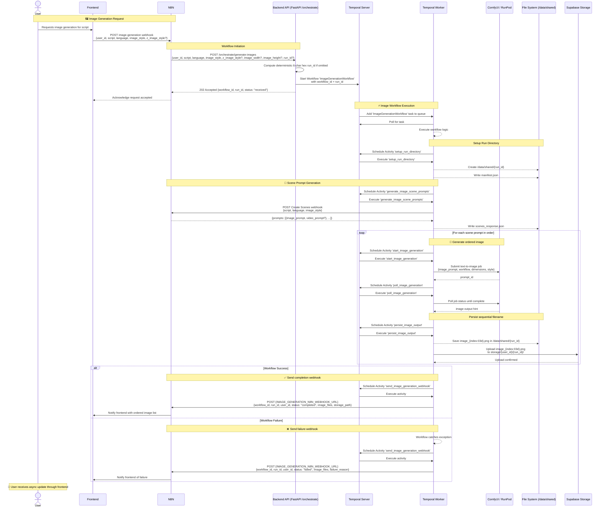

# Image Generation System - Sequence Diagram

## API Endpoints Reference

| Endpoint | Method | Description |
|----------|--------|-------------|
| `/orchestrate/generate-images` | POST | Create new image generation job and return `workflow_id` + `run_id` immediately |
| `{IMAGE_GENERATION_N8N_WEBHOOK_URL}` | POST | N8N receives image-generation completion/failure notifications |

## Data Flow

### File System
- `/data/shared/{run_id}/` - Run working directory
- `manifest.json` - Initial request payload for the workflow run
- `scenes_response.json` - Full Create Scenes response persisted for later reuse
- `image_001.png`, `image_002.png`, ... - Ordered local image outputs

### Supabase Storage
- `storage/{user_id}/{run_id}/image_001.png`
- `storage/{user_id}/{run_id}/image_002.png`
- Images are uploaded in the same order as the generated scene prompts

## Processing Pipeline

1. **API initiation (`/orchestrate/generate-images`)**
   - Accepts `user_id`, `script`, `language`, and image-generation options.
   - Generates a deterministic 6-character hexadecimal `run_id` when one is not provided.
   - Starts `ImageGenerationWorkflow` and immediately returns `202 Accepted`.

2. **Prompt generation**
   - `generate_image_scene_prompts` calls the Create Scenes webhook.
   - The full response is saved to `scenes_response.json` for future video-clip generation stages.

3. **Ordered image generation**
   - For each scene prompt, the workflow submits image generation and polls until completion.
   - `persist_image_output` stores the final image locally with a deterministic sequential name.
   - The same file is uploaded to Supabase Storage under `storage/{user_id}/{run_id}/`.

4. **Async frontend notification**
   - On success, the workflow sends an ordered list of image filenames to N8N.
   - On failure, the workflow sends the failure reason and any images already persisted.

## Key Participants

- **Frontend** - Initiates the request and receives async updates from N8N.
- **N8N** - Entry and exit integration point for the frontend.
- **Backend API** - Starts the Temporal workflow.
- **Temporal Worker** - Runs the workflow and activities.
- **ComfyUI / RunPod** - Generates images from prompts.
- **File System** - Persists local artifacts under `/data/shared/{run_id}`.
- **Supabase Storage** - Stores ordered image files per user and run.
